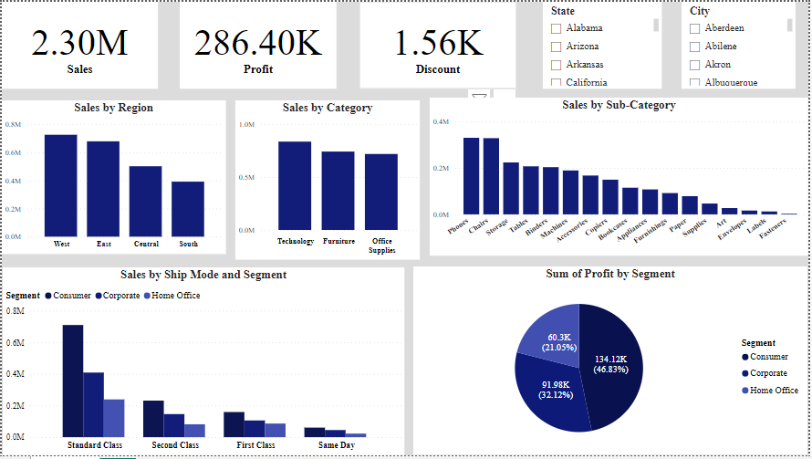

# Marketing-Insight-Report
I started my internship at HNG 12 Cohort in January 2025, and this is my first task. HNG is a remote internship program focused on developing technical skills in data analysis, software development, and other fields. More details can be found on their official website:[HNG Internship](https://hng.tech/internship)

### Introduction
This project focuses on analyzing Sample Superstore data to uncover patterns, trends, and insights that can enhance business decision-making. The dataset includes categorical data such as Ship Mode, Segment, Country, City, State, Region, Category, and Subcategory, as well as numerical data such as Postal Codes, Sales, Quantity, Discount, and Profit. Understanding these factors is crucial for optimizing business performance and forecasting future sales. Power BI was used for data visualization to make insights more accessible.

### Data Exploration
The initial phase involved data cleaning, handling missing values, and ensuring consistency. Key variables analyzed include Sales, Discount, and Profit. Descriptive statistics and visualizations such as histograms and pie charts were used to examine distributions, detect outliers, and identify patterns. Slicers were used to enhance data exploration by enabling easy filtering based on State and City. Cards highlighted key performance metrics, providing an instant overview of sales trends.

### Findings
Regional Trends: The West and East regions recorded higher sales, while the South region had lower sales.
Product Category Insights: Technology had the highest number of purchases, with Phones being the top subcategory.
Consumer Segment Leads in Profitability: The Consumer segment generated the highest profit.

### Conclusion
The analysis provided valuable insights into key sales drivers. Businesses can optimize marketing efforts in low-performing regions and adjust inventory to match demand. Future work could involve predictive modeling to improve forecasting and decision-making.

